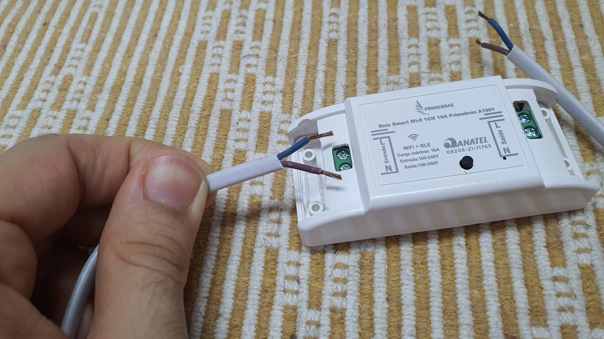
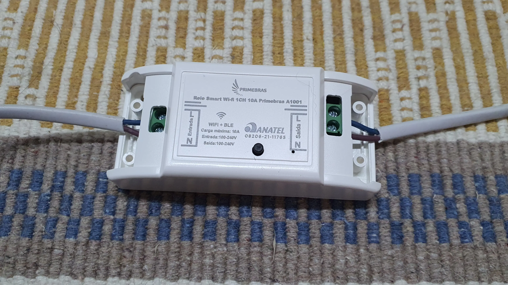
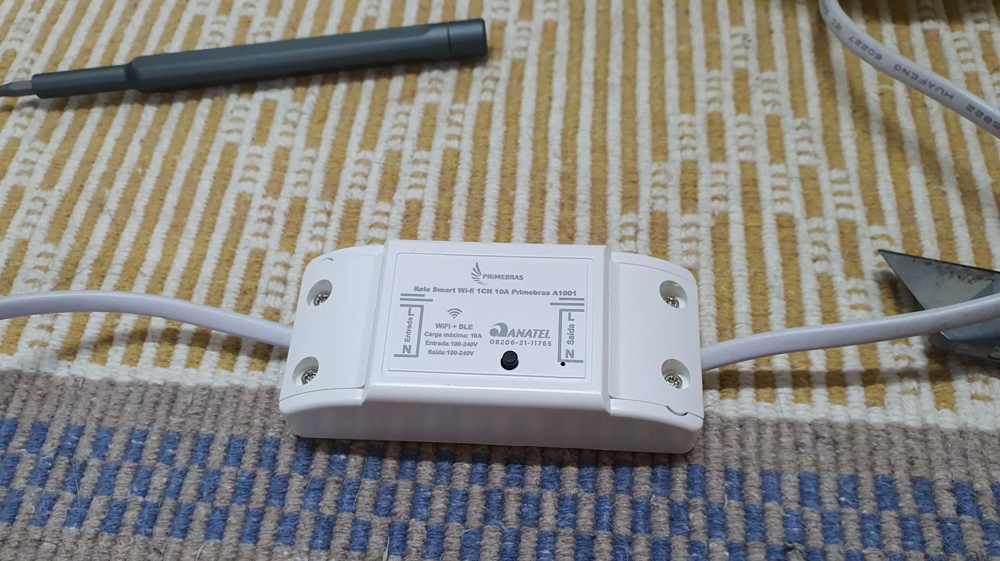

My wife gave me this awesome electric egg boiler in Christmas 2021. It's very simple: add some water to the plate, add the eggs using the support, cover it, turn it on, and wait. 

The boiler will heat the water and turn off automatically when the water finishes evaporating. It's just a thermal switch: it turns off because the plate gets hotter once the water is not there anymore. The problem is that although it turns off, it doesn't flip the on/off switch, like, say, those electric kettles. So, if you don't manually push the switch, it keeps turning on and off as the temperature rises and falls.

Besides this inconvenience, I want to wake up with my eggs ready for eating. So, let's add a smart relay to program a time to turn the boiler on, wait for the eggs to get ready, and **actually** turn it off.

 ## The "smart" relay

I went with a model [like this one](https://amzn.to/3Uafdkz) (mine is a bit different because I bought here in Brazil, but should be very similar). It's very intuitive to wire it: the plug wires go to the "input" side and the boiler wires go to the "output" side.

## Testing the relay

These IoT gadgets normally ask you to install and setup an account in their app. You set it up, and next you should be able to sync it with Google Home or Siri, after that you can forget the app. On this particular one, though, I had to find a different account conection in Google Home than the name of its app. So, make sure to read the instructions on how to do this, as it might not be as intuitive as it should.

After that, you can control the device on Google Home and, more importantly, set up automations. I made this demo where it turns on, waits for 3 seconds, and then turns off. The real automation will take about 13 minutes. That's the time it takes to finish boiling the eggs (yes, I measured). Even if it's not perfect, it doesn't matter: the boiler will turn itself off and the relay will just make sure that it doesn't turn on again.

## Boil while they sleep

A better automation would be to detect when the boiler turns off and the open the relay, but the wiring and the coding would be more complex (coding? this project has 0 lines of code), and you would still need to use the relay to turn the boiler on. For now, the boiler works great.


